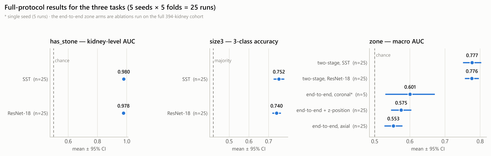

# Automated Structured Pre-Report Generation for Nephrolithiasis on Non-Contrast CT

Code, figures and aggregate results for a retrospective single-centre study that generates
structured preliminary radiology reports for kidney stones from non-contrast CT, without
manual slice selection and without excluding bilateral disease.

The kidney is the modelling unit and the patient is the splitting unit. Each kidney is
localized automatically by whole-body organ segmentation, every axial slice intersecting the
organ enters a multiple-instance bag, and three fields — stone presence, size class and
intrarenal zone — are predicted and assembled into a report by a deterministic, invertible
template engine.

> **Data are not included.** The imaging archive and the label spreadsheets contain patient
> data and are not part of this repository. See [`docs/data-availability.md`](docs/data-availability.md).

---

## Results

Every configuration is evaluated with patient-level stratified five-fold cross-validation
repeated over five seeds — **25 runs per configuration**. Values are the mean over runs with
95% confidence intervals; comparisons against the majority baseline are paired on the same
(seed, fold) cells. Modelling cohort: 195 patients, 195 examinations, 390 kidneys.

| Task | Metric | Hybrid CNN-Transformer | ResNet-18 | Baseline |
|---|---|---|---|---|
| Stone presence (kidney) | AUC | **0.980** (0.975–0.986) | 0.978 (0.972–0.985) | 0.631 |
| Stone presence (patient) | accuracy | 0.975 | 0.975 | — |
| Size class | accuracy | **0.752** (0.725–0.780) | 0.741 (0.718–0.763) | 0.419 |
| Size class | quadratic weighted κ | **0.726** (0.692–0.760) | 0.698 (0.649–0.747) | — |
| Intrarenal zone (two-stage) | macro AUC | **0.777** (0.751–0.803) | 0.776 (0.757–0.796) | 0.517 |
| **Report level** | triplet micro F1 | **0.533** | 0.507 | — |

**The headline result is the gap between the last row and the others.** A report statement is
correct only when side, zone and size class are simultaneously correct, so field accuracies
compound multiplicatively: 0.96 × 0.73 × 0.74 ≈ 0.52 predicts the measured 0.533. An AUC of
0.980 does not translate into report-level agreement of the same order, which is why
composite fact-level metrics are reported alongside classification metrics.

Two further findings are worth stating plainly:

- **The intrarenal zone is not learnable end-to-end here.** Zone is a *position* along the
  craniocaudal axis, and log-sum-exp pooling over a bag of slices is permutation-invariant, so
  the architecture discards the only variable that separates the classes. Axial, axial + slice
  position and coronal formulations all sit between 0.55 and 0.60 macro AUC. Decomposing the
  task — run the stone detector, take the position of its highest-scoring slice, then map that
  position to a zone with two thresholds fitted on the training fold — reaches 0.777 with no
  gradient training for zone at all.
- **That two-stage estimate reaches 94.8% of what is attainable.** Applying the same threshold
  rule to stone positions measured directly from the images gives 0.777 on the same kidneys,
  so the residual error is disagreement between radiological zone naming and geometric thirds,
  not a modelling deficit.

Full tables are in [`docs/results.md`](docs/results.md); the error decomposition is in
[`docs/error-analysis.md`](docs/error-analysis.md).

---

## Figures

| | |
|---|---|
|  |  |
| Full-protocol results for the three tasks | Where the composite error comes from |

All figures are in [`figures/`](figures). Figures showing CT data display de-identified
per-kidney crops from the study cohort and carry pseudonymous case identifiers only.

---

## Repository layout

```
src/common/         shared library: paths, labels, HU windowing, report templates,
                    report parser, fact set, ML data/models/transforms
src/pipeline/       numbered stages, 00 through 29 (see docs/pipeline.md)
tests/              unit tests for the parsers and the ML data layer
figures/            publication figures
results/            aggregate result tables — no per-patient rows
docs/               pipeline description, full results, data availability
```

Stage scripts import the shared library through `src/`, so run them from the repository root
with `src` on the path:

```bash
PYTHONPATH=src python src/pipeline/19_train_kidney.py --task has_stone --config my_run
```

---

## Installation

Two environments are used, because the segmentation stage and the data stage have
incompatible dependencies.

```bash
python -m venv .venv && . .venv/bin/activate
pip install -r requirements.txt          # stages 01-18, 21, 22 (no torch)

python -m venv .venvtrain && . .venvtrain/bin/activate
pip install -r requirements-train.txt --extra-index-url https://download.pytorch.org/whl/cu126
```

Stage 08 additionally requires [TotalSegmentator](https://github.com/wasserth/TotalSegmentator)
in its own environment. Training was run on a single RTX 3090; one run takes two to four
minutes, so a full 25-run configuration takes roughly 1.5 to 2 hours.

## Configuration

Nothing is hard-coded to a machine. Two environment variables control all paths:

| Variable | Meaning | Default |
|---|---|---|
| `KIDNEYCT_ROOT` | working directory holding the stage outputs | `./workdir` |
| `KIDNEYCT_SOURCES` | JSON describing the read-only DICOM and label sources | `$KIDNEYCT_ROOT/config/sources.json` |

Copy [`config/sources.example.json`](config/sources.example.json) and edit it to point at your
own data. Stage 17 additionally reads `KIDNEYCT_PREVIOUS` when cross-checking against an
earlier cohort, and exits cleanly when that directory is absent.

## Reproducing the reported numbers

Model training and figure generation depend on the imaging archive. Two stages do not, and
run from the stored prediction dumps alone:

```bash
PYTHONPATH=src python src/pipeline/26_evaluate_reports.py --model sst    # report-level metrics
PYTHONPATH=src python src/pipeline/29_error_analysis.py  --model sst    # error decomposition
```

Determinism is enforced throughout: seeds are fixed, `cudnn.deterministic` is enabled and
`benchmark` disabled, so repeating a run reproduces its prediction file byte for byte.

---

## Protocol rules

These are binding for anything added to this repository.

1. The modelling unit is the kidney; the splitting unit is the patient. Both kidneys of a
   patient always share a fold.
2. Five seeds × five folds per configuration. Single-seed results are not reported — the
   confidence interval from one seed is three to five times too narrow.
3. Report mean with 95% CI, and compare against the majority baseline with a **paired** t test
   and Wilcoxon signed-rank test on the same (seed, fold) cells.
4. Horizontal flipping is forbidden on whole-body images and permitted on kidney crops; the
   left kidney is mirrored to the canonical orientation.
5. Evaluation always uses the full stack of slices; training uses a stratified-uniform bag
   of K = 16.

## Citation

See [`CITATION.cff`](CITATION.cff). The manuscript is under review; this file will be updated
with the journal reference and DOI on acceptance.

## License

Code is released under the MIT License (see [`LICENSE`](LICENSE)). The figures and result
tables are released under CC BY 4.0. The imaging data are not released.
