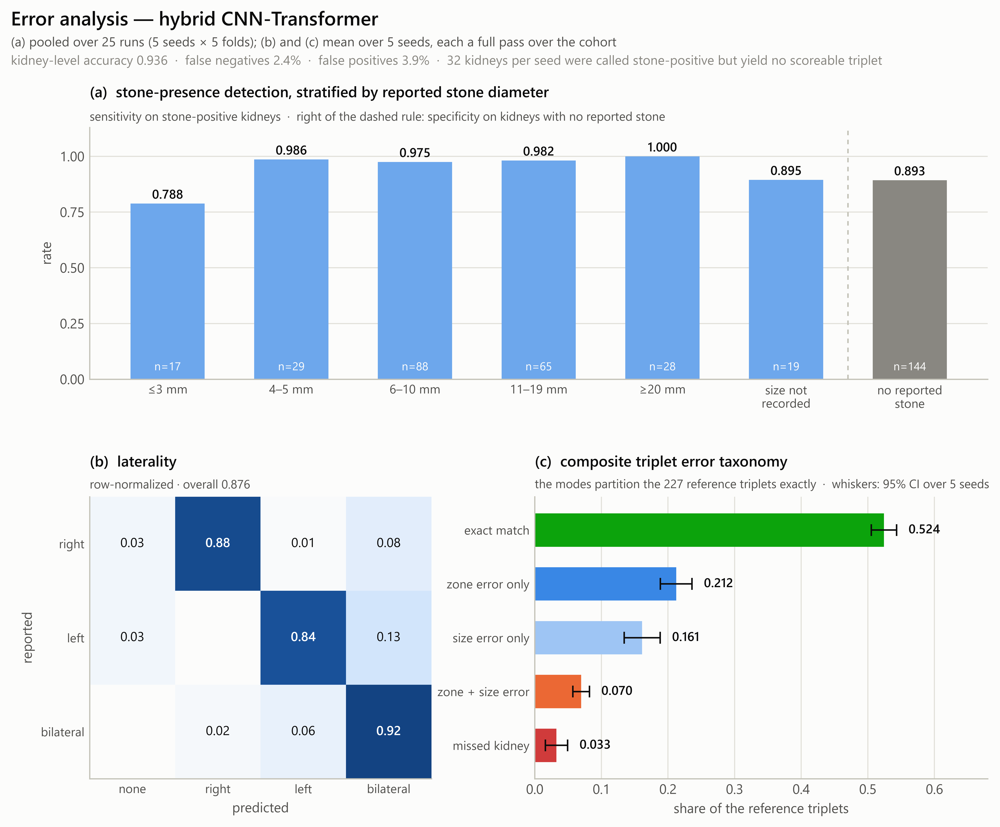

# Error analysis

A composite F1 of 0.533 states how often a complete report statement is correct but not which
part of the statement fails. Because every cross-validation prediction is kept on disk, the
errors can be decomposed without retraining anything.

```bash
PYTHONPATH=src python src/pipeline/29_error_analysis.py --model sst
```

Detection statistics are pooled over the 25 runs of the full protocol. Report-level statistics
are computed per seed — each seed being one complete pass over the cohort — and reported as the
mean over five seeds with 95% confidence intervals.



## Detection

Across the 1950 pooled kidney decisions (390 kidneys × 5 seeds), 2.4% were false negatives and
3.9% false positives, for a kidney-level accuracy of 0.936.

| Stratum | Kidneys | Hybrid | ResNet-18 |
|---|---|---|---|
| ≤ 3 mm | 17 | 0.788 | 0.776 |
| 4–5 mm | 29 | 0.986 | 0.952 |
| 6–10 mm | 88 | 0.975 | 0.980 |
| 11–19 mm | 65 | 0.982 | 0.985 |
| ≥ 20 mm | 28 | 1.000 | 0.993 |
| Stone present, diameter not recorded | 19 | 0.895 | 0.884 |
| *No reported stone (specificity)* | *144* | *0.893* | *0.907* |

The gradient measures directly on the detection task the partial-volume mechanism that was
previously only inferred from the size task: below roughly 4 mm a calculus occupies a small
fraction of the voxel and its apparent attenuation falls towards that of the parenchyma. Above
that threshold detection is essentially saturated and contributes little to report-level error.

## Persistent errors

Seventeen of 390 kidneys (4.4%) were classified incorrectly in at least 80% of the 25 runs, so
they are systematic rather than stochastic: seven missed stones and ten false alarms. Among the
seven missed, three carried a stone of 3 mm or less and two had no recorded diameter.

Two of the seventeen carry the automatic segmentation plausibility flag, against seven of 390
kidneys overall (odds ratio 9.8, one-sided Fisher exact p = 0.033). Imperfect organ
segmentation is a contributing but minority cause.

Because the negative class is defined as "not reported" rather than as radiologist-confirmed
absence, a false alarm on a kidney with a small unreported density cannot be distinguished from
a genuine model error. These seventeen kidneys are individually identified in the run output
and form a small, well-defined set that a confirmatory radiologist review could resolve.

Two cases in that set are instructive. One examination appears twice, in opposite directions:
its right kidney carries a reported 18 mm stone that is persistently missed, while its left
kidney is persistently called stone-positive although no stone is reported there. The left mask
of that examination has a volume of 7 cm³ against a cohort median of 153 cm³ and carries the
plausibility flag, so the crop presented to the model on that side is not a complete kidney. In
another, the right kidney has no characterized stone at all; its positive label derives entirely
from a laterality conflict resolved by prior radiologist adjudication, so the model's
disagreement is with an adjudicated rather than an unambiguous label.

## Laterality

Laterality errors are directionally asymmetric. Unilateral cases were reported as bilateral in
8.1% of right-sided and 12.6% of left-sided cases, whereas bilateral cases were reduced to a
single side in 7.8%. A further 3.2% and 3.4% of unilateral cases were reported as having no
stone.

| Reference \ Predicted | none | right | left | bilateral | Total |
|---|---|---|---|---|---|
| Right | 12 | **325** | 3 | 30 | 370 |
| Left | 12 | 0 | **294** | 44 | 350 |
| Bilateral | 0 | 5 | 15 | **235** | 255 |

Counts over 975 case evaluations (195 cases × 5 seeds). No case in the cohort has a reference
laterality of "none", so that row is empty by construction; "none" remains available as a
prediction.

Over-calling the contralateral kidney is the dominant laterality error and follows directly
from the kidney-level false-positive rate. For a pre-report intended for radiologist
verification this is the less harmful direction — it prompts inspection of a kidney rather than
omitting one — but it is the principal reason four-class laterality agreement (0.876) falls
below per-kidney stone-presence agreement (0.950).

## Composite triplets

Partitioning the 227 reference triplets by failure mode shows that detection is not the
limiting factor. The five modes partition the reference triplets exactly.

| Failure mode | Hybrid | ResNet-18 |
|---|---|---|
| Exact match | 0.524 (0.505–0.543) | 0.498 (0.457–0.539) |
| Zone error only | 0.212 (0.189–0.236) | 0.225 (0.211–0.239) |
| Size class error only | 0.161 (0.134–0.188) | 0.182 (0.162–0.201) |
| Zone and size class error | 0.070 (0.057–0.082) | 0.060 (0.054–0.066) |
| Kidney called stone-free | 0.033 (0.016–0.049) | 0.036 (0.024–0.048) |
| *Zone implicated in any failure* | *0.282 (59.2% of failures)* | *0.285 (56.7%)* |
| *Size class implicated in any failure* | *0.231 (48.5% of failures)* | *0.242 (48.1%)* |

As a share of the 0.476 that failed: zone alone 44.6%, size class alone 33.9%, both together
14.6%, missed detection 6.9%. **Zone is implicated in 59.2% of all failed triplets and size
class in 48.5%, while detection accounts for under 7%.** This is consistent with the measured
ceiling of the zone task and identifies zone as the field that would benefit most from further
work.

### Consistency with the published metrics

The decomposition was not fitted to the report-level metrics, yet reproduces them. The
exact-match share of 0.524 equals the composite recall and its complement, 0.476, equals the
omission rate; for ResNet-18 the corresponding values are 0.498 and 0.502. The precision side
follows in the same way: predicted triplets amount to 0.967 per reference triplet, of which
0.443 are not exact matches, giving the hallucination rate of 0.458.

## A property of the evaluation that should be stated explicitly

The size and zone heads are defined only on the 227 kidneys with a characterized stone, so a
kidney that the model incorrectly calls stone-positive produces no triplet at all — a mean of
32 kidneys per seed were called stone-positive without yielding a scoreable triplet.

The hallucination rate of 0.458 therefore measures mischaracterization of real stones rather
than the invention of stones that do not exist, and the composite metric does not charge
detection false positives. A deployed system would have to characterize every kidney it calls
positive, and its composite agreement would consequently be lower than the value reported here.

## A hypothesis that was tested and did not hold

Persistent false alarms were tested for enrichment in unreported high-attenuation material,
using the count of pixels at or above the 826 HU equivalent within the kidney crop. There was
no difference (Mann-Whitney p = 0.76). The measure is too crude — it is dominated by cortical
and vascular calcification and by the renal sinus boundary rather than by stones — so the
question remains open rather than answered in the negative. It is recorded here because a
tested and discarded hypothesis is part of the analysis.
